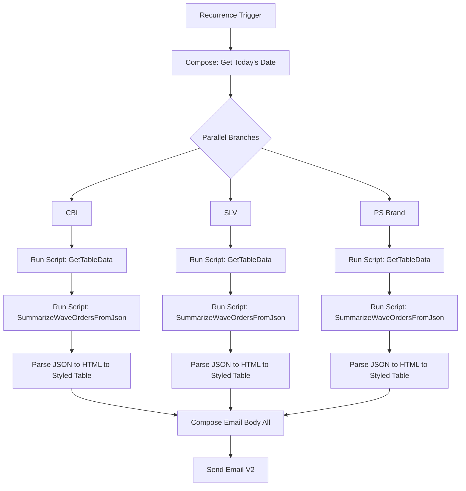

# 📦 Multi-Brand Wave Summary Automation  
### *Cart.com Operations – Automated Excel & Email Workflow*

---

## 🧠 Overview
This Power Automate project automatically aggregates and emails **Wave Lists** for multiple brands — **CBI**, **SLV**, and **PS** — from an Excel master file.  

Each brand runs in **parallel**, processes its own sheet via **Office Scripts**, and generates a **styled HTML table**.  
All three tables are combined into a single, fully formatted email showing each brand’s current-day waves, order counts, sources, and induction status.

---

## ⚙️ Architecture

| Component | Purpose |
|------------|----------|
| **Power Automate Flow** | Orchestrates the 3 parallel brand pipelines. |
| **Excel Workbook** | Central data source (e.g., `All Brand SLA Internal (Current).xlsx`). |
| **Office Script ① – GetTableData** | Reads and cleans raw brand sheet data (`CBI`, `SLV`, `PS`). |
| **Office Script ② – SummarizeWaveOrdersFromJson** | Aggregates Wave#, counts distinct orders, filters by *Req Ship Date*, adds *Inducted ?* check. |
| **HTML Styling Chain** | `replace()` expressions apply consistent CSS to all tables. |
| **Email Composer (Concat)** | Combines the three tables with titles and timestamps. |
| **Outlook Send Email (V2)** | Sends the formatted summary to stakeholders. |

---

## 🧩 Flow Structure

### 1️⃣ Trigger
- **Type:** Recurrence  
- **Interval:** Every 4 hours (or scheduled)

### 2️⃣ Parallel Branches – CBI / SLV / PS
Each branch performs identical steps:

#### A. Run Office Script – *GetTableData*
Returns JSON string with:

Source Code | Order Num | Wave# | Req Ship Date | CHUTE

#### B. Run Office Script – *SummarizeWaveOrdersFromJson*
**Parameters**

```
jsonText → outputs('Get_SLA_Data_{BRAND}')?['result']
targetYmd → outputs('Get_today's_date')
```

**Output**
```json
{
  "success": true,
  "message": "Summarized N unique Waves for YYYY-MM-DD.",
  "rows": [
    {
      "Wave #": "12345",
      "Order Count": 42,
      "Source Codes": "B2B, B2C",
      "Inducted ?": "✓",
      "Req Ship Date": "2025-10-14"
    }
  ]
}
```

#### C. Parse JSON Action

```json
{
  "type": "object",
  "properties": {
    "success": { "type": "boolean" },
    "message": { "type": "string" },
    "rows": {
      "type": "array",
      "items": {
        "type": "object",
        "properties": {
          "Wave #": { "type": "string" },
          "PCL Order Count": { "type": "integer" },
          "LTL Order Count": { "type": "integer" },
          "Source Codes": { "type": "string" },
          "Inducted ?": { "type": "string" },
          "Req Ship Date": { "type": "string" }
        },
        "required": ["Wave #", "PCL Order Count", "LTL Order Count", "Req Ship Date"]
      }
    }
  },
  "required": ["success", "rows"]
}

```

#### D. Create HTML Table + Style It

1. Input: `body('Parse_JSON')?['rows']`

2. Apply chained `replace()` expressions for styling:
  
```
replace(
  replace(
    replace(
      body('Create_HTML_table_Wave'),
      '<table>',
      '<table role="presentation" align="center" cellpadding="0" cellspacing="0" style="border-collapse:collapse;border-spacing:0;width:66%;max-width:800px;min-width:340px;margin:0 auto;border:1px solid #E5E7EB;font-family:Segoe UI,Arial,sans-serif;font-size:13px;">'
    ),
    '<th>',
    '<th style="border:1px solid #E5E7EB;background:#F3F4F6;text-align:center;padding:8px 12px;font-size:14px;">'
  ),
  '<td>',
  '<td style="border:1px solid #E5E7EB;padding:8px 12px;text-align:center;font-size:14px;">'
)
```

3. Each branch ends with a Compose holding its final styled table:

```
styledTable_Headers_CBI
styledTable_Headers_SLV
styledTable_Headers_PS
```

### 3️⃣ Merge Results → Single Email Body

#### Compose – Email_Body_All

```
concat(
'<!DOCTYPE html><html><head><meta charset="UTF-8"><title>Wave Lists</title>',
'<style>',
'body{margin:0;padding:16px;font-family:Segoe UI,Arial,sans-serif;color:#0f172a}',
'h2{margin:16px 0 8px 0;font-weight:700;font-size:18px;text-align:center}',
'.gap{height:16px}',
'</style></head><body>',
'<h2>CBI Wave List ', outputs('Get_today\'s_date') ,'</h2>',
if(empty(outputs('styledTable_Headers_CBI')),
  concat('<p style="text-align:center;color:#64748b;">No CBI rows for ', outputs('Get_today\'s_date') ,'</p>'),
  outputs('styledTable_Headers_CBI')
),
'<div class="gap"></div>',
'<h2>SLV Wave List ', outputs('Get_today\'s_date') ,'</h2>',
if(empty(outputs('styledTable_Headers_SLV')),
  concat('<p style="text-align:center;color:#64748b;">No SLV rows for ', outputs('Get_today\'s_date') ,'</p>'),
  outputs('styledTable_Headers_SLV')
),
'<div class="gap"></div>',
'<h2>PS Wave List ', outputs('Get_today\'s_date') ,'</h2>',
if(empty(outputs('styledTable_Headers_PS')),
  concat('<p style="text-align:center;color:#64748b;">No PS rows for ', outputs('Get_today\'s_date') ,'</p>'),
  outputs('styledTable_Headers_PS')
),
'<div class="gap"></div>',
'<p style="color:#64748b;font-size:12px;text-align:center;margin-top:24px;">Generated at ',
formatDateTime(utcNow(),'yyyy-MM-dd HH:mm:ss'),
' UTC</p>',
'</body></html>'
)
```

### 4️⃣ Send Email (V2)

| Setting |	Value |
|--------|--------|
|**To**| Stakeholders / Ops Team |
|**Subject	Wave Lists**| @{outputs('Get_today\'s_date')} |
|**Body**|	@{outputs('Email_Body_All')} |
|**Is HTML**|	✅ Yes |

#### ✅ Sample Output

**Subject**: Wave Lists – 2025-10-14

**Email Body**

```
CBI Wave List 2025-10-14
----------------------------------------------------
Wave # | Order Count | Source Codes | Inducted ? | Req Ship Date

SLV Wave List 2025-10-14
...

PS Wave List 2025-10-14
...
```

At the footer:

`Generated at 2025-10-14 21:37:52 UTC`

#### 🧾 Field Logic
|Column|	Source|	Logic|
|------|------|-----|
|**Wave #**|	"Wave#"|	Wave identifier|
|**Order Count**	|"Order Num"|	Count of distinct orders|
|**Source Codes**	|"Source Code"|	Unique sources (comma-separated)|
|**Inducted ?**	|"CHUTE"|	✓ if non-blank chutes > 5 per wave|
|**Req Ship Date**|	"Req Ship Date"|	Filter = target date from Flow|


## 🧮 Data Flow Summary


---

## 🧰 Maintenance Notes

### 🔧 General

**Column names must match exactly between Excel and the Office Scripts:**
- `Source Code`
- `Order Num`
- `Wave#`
- `Req Ship Date`
- `CHUTE`

> **Note:** If headers change, update both `GetTableData` and `SummarizeWaveOrdersFromJson`.

### 🧾 "Inducted ?" Threshold

Inside the summarization script:
```typescript
const inducted = chuteCount > 5 ? "✓" : "";
```

Change the number `5` to alter the minimum non-blank CHUTE count needed for a ✓.

### 🕒 Timezone Formatting

By default, timestamps are shown in UTC:
```typescript
formatDateTime(utcNow(),'yyyy-MM-dd HH:mm:ss')
```

To display Eastern time instead:
```typescript
formatDateTime(convertTimeZone(utcNow(),'UTC','Eastern Standard Time'),'yyyy-MM-dd HH:mm:ss')
```

### 🧱 Adding a New Brand

To include another brand (e.g., XYZ):

1. Duplicate one of the three parallel branches.
2. Rename all actions (`GetTableData`, `SummarizeWaveOrdersFromJson`, `Parse_JSON`, `Create HTML Table`, etc.) with the new brand prefix.
3. Add its styled table output (`styledTable_Headers_XYZ`) to the final `Email_Body_All` compose block following the same pattern.

### 💅 Styling Tweaks

- **Table width:** Change `width:66%` in the table `<style>` to adjust size.
- **Font size:** Edit `font-size:14px` in `<td>` / `<th>` replacements.
- **Colors:** Modify `#E5E7EB` (border) or `#F3F4F6` (header background) to fit brand palette.

---

## 🧩 Troubleshooting Tips

| Symptom | Likely Cause | Fix |
|---------|--------------|-----|
| Email shows blank tables | No rows matched today's `Req Ship Date`. | Verify Excel data or adjust filter date. |
| JSON parse error | Script output malformed or headers changed. | Check column names; rerun `GetTableData`. |
| Table too wide | Default `width:100%` not replaced. | Ensure `replace()` sets `width:66%;max-width:800px;margin:0 auto;`. |
| Tall row spacing in Outlook | Paragraph tags inside cells add margin. | Replace `<p>`/`</p>` with `<span>`/`</span>` inside HTML. |
| No checkmark in "Inducted ?" | Fewer than 6 non-blank CHUTE rows. | Lower or raise threshold in the script. |

---

## 🏁 Version History

| Version | Date | Description |
|---------|------|-------------|
| 1.0 | 2025-10-14 | Initial 3-brand parallel automation |
| 1.1 | 2025-10-14 | Added Inducted ? logic and Req Ship Date column |
| 1.2 | 2025-10-14 | Unified HTML email with timestamp |
| 1.3 | 2025-10-14 | Styling and documentation refinements |

---

## 👤 Author

**Abraham Candra**  
Warehouse Operations Automation – Cart.com (Groveport)

Designed and implemented multi-brand automated Wave List reporting using Power Automate, Office Scripts, and Outlook integration.
