# 📦 Multi-Brand Wave List (Cartons) Automation
### *Logistics Operations – Carton-Level SLA & Wave Visibility*

---

## 🧠 Overview

This Power Automate project generates and emails a **Wave List (Cartons)** summary for multiple brands from a centralized SLA Excel file.

Unlike earlier order-based reporting, this system aggregates data at the **distinct carton (CTN) level**, preventing double-counting and providing accurate operational visibility.

Each brand runs in parallel using shared Office Script logic and outputs a standardized, styled HTML table. All tables are merged into a single unified email.

---

## ⚙️ Architecture

| Component | Purpose |
|-----------|---------|
| **Power Automate Flow** | Orchestrates parallel brand pipelines |
| **Excel Workbook** | Central SLA data source |
| **Office Script – GetTableData** | Extracts and normalizes raw worksheet data |
| **Office Script – SummarizeWaveCartonsFromJson** | Aggregates distinct CTNs per wave |
| **HTML Styling Chain** | Applies consistent width + cell formatting |
| **Email Composer** | Combines brand tables into one report |
| **Outlook Send Email (V2)** | Dispatches final formatted summary |

---

## 🧩 Flow Structure

### 1️⃣ Trigger

- **Type:** Recurrence
- **Schedule:** Every X hours

---

### 2️⃣ Parallel Branches – Brand 1 / Brand 2 / Brand 3

Each branch executes:

#### A. Run Script – GetTableData

Returns JSON rows containing:

```
SOURCE_CODE
WAVE
SLA_DATE
CTN
CTN_STAT
CHUTE
LTL_PCL
PPV_EMB (optional)
```

---

#### B. Run Script – SummarizeWaveCartonsFromJson

### Core Logic

✔ Filter rows where:
- `LTL_PCL = "PCL"`
- `SLA_DATE <= Today`

✔ Aggregate **distinct CTNs per wave**

✔ Compute:

| Column | Logic |
|--------|-------|
| **Wave #** | Unique wave identifier |
| **Source Code** | Distinct SOURCE_CODE values merged (comma-separated) |
| **SLA Notation** | `SLA-XX-{Cartons}` (+ `(EMB EMB)` if applicable) |
| **EMB/PPV Count** | Distinct CTNs where `PPV_EMB != blank` (optional column safe) |
| **Cartons** | Distinct CTN count |
| **Packed +** | Distinct CTNs where `CTN_STAT` not Printed/In Packing |
| **Packed Progress** | `Packed + / Cartons` |
| **Inducted ?** | ✓ if (Chute CTNs > 5) OR (Packed = Cartons) |

---

### Sample Output JSON

```json
{
  "success": true,
  "rows": [
    {
      "Wave #": "12345",
      "Source Code": "2B-LG, 2B-SM",
      "SLA Notation": "SLA-SM-70 (29 EMB)",
      "EMB/PPV Count": 29,
      "Cartons": 70,
      "Packed +": 70,
      "Packed Progress": "100.00%",
      "Inducted ?": "✓"
    }
  ]
}
```

---

### 3️⃣ Parse JSON

Schema expects:

- Wave #
- Source Code
- SLA Notation
- EMB/PPV Count
- Cartons
- Packed +
- Packed Progress
- Inducted ?

---

### 4️⃣ HTML Table Styling

After **Create HTML Table**, chained `replace()` styling applies:

**Table Width Wrapper**
```
width: 95%;
max-width: 1200px;
min-width: 480px;
```

**Header Styling**
- Light gray background
- Centered text
- 14px font
- Border collapse

**Cell Styling**
- Border: `#E5E7EB`
- Padding: `8px 10px`
- Center-aligned
- Outlook-safe line height

---

### 5️⃣ Email Composition

Final email structure:

```
Brand 1 Wave List – {Date}
[Styled Table]

Brand 2 Wave List – {Date}
[Styled Table]

Brand 3 Wave List – {Date}
[Styled Table]

Generated at {Timestamp}
```

Timezone configurable (UTC or Eastern).

---
## 🧮 Data Flow Summary

```mermaid
flowchart TD
  A[Recurrence Trigger] --> B[Get Today Date]
  B --> C{Parallel Branches}
  C --> B1[Brand 1]
  C --> B2[Brand 2]
  C --> B3[Brand 3]
  B1 --> D1[GetTableData]
  D1 --> E1[SummarizeWaveCartonsFromJson]
  E1 --> F1[Parse JSON → Styled Table]
  B2 --> D2[GetTableData]
  D2 --> E2[SummarizeWaveCartonsFromJson]
  E2 --> F2[Parse JSON → Styled Table]
  B3 --> D3[GetTableData]
  D3 --> E3[SummarizeWaveCartonsFromJson]
  E3 --> F3[Parse JSON → Styled Table]
  F1 --> G[Compose Unified Email]
  F2 --> G
  F3 --> G
  G --> H[Send Email]
```

---
## 🧱 Key Design Decisions

**✔ Distinct CTN Deduplication**

Prevents inflated counts when:
- Same carton appears multiple times
- Multiple source codes exist per carton

**✔ Optional PPV_EMB Handling**

If column is missing (e.g., fully blank export):
- Script does not fail
- EMB count defaults to 0

**✔ Inducted Logic Refinement**

Wave marked inducted if:
- 5 distinct chute cartons, OR
- 100% packed

Prevents small waves from showing false non-inducted state.

---

## 🧩 Maintenance Notes

**Required Columns**

- SOURCE_CODE
- WAVE
- SLA_DATE
- CTN
- CTN_STAT
- CHUTE
- LTL_PCL

**Optional Column**

- PPV_EMB

**Adjust Inducted Threshold**

Inside script:
```
a.chuteCtns.size > 5
```
Change `5` to adjust minimum chute threshold.

**Adjust Email Width**

Inside styling replace block:
```
width: 95%;
max-width: 1200px;
```
Modify if needed.

---

## 🧩 Troubleshooting

| Issue | Cause | Fix |
|-------|-------|-----|
| Missing EMB column error | Column fully blank in export | Already handled via optional logic |
| Carton count mismatch | Duplicate CTN rows | Script uses `Set<string>` dedupe |
| Wave shows 100% but not inducted | Old logic | Fixed in v2.9.1 |
| Table squeezed in email | Width too small | Updated to 95% / 1200px |

---

## 🏁 Version History

| Version | Description |
|---------|-------------|
| 2.9.0 | Converted to carton-level aggregation + SLA notation |
| 2.9.1 | Inducted logic includes 100% packed rule |
| 2.8.x | Multi-brand chute + hospital enhancements |
| 2.x | Legacy order-based wave summaries |

---

## 👤 Author

**Abraham Efraim**  
Warehouse Operations Automation  
Power Automate • Office Scripts • Excel Data Engineering • Email Rendering
